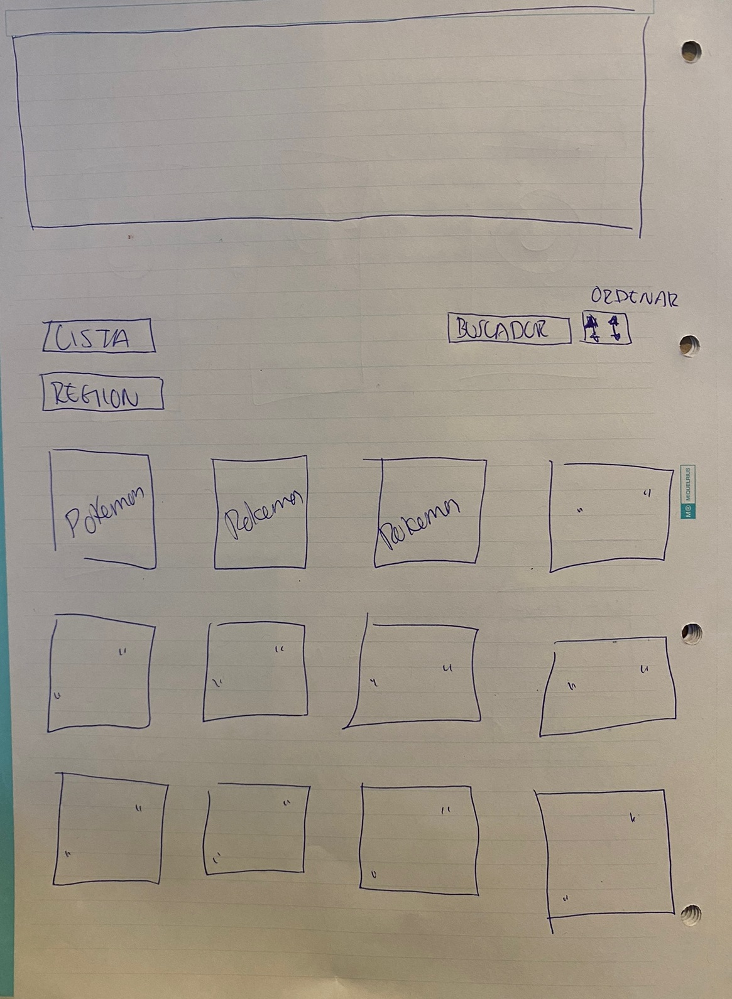

#NAME
POKEDEX

#DESCRIPTION
POKEDEX fue creada para el proyecto Data-Lovers de Laboratoria. Pokedex es una página que pretende mostrar pokemones de la región Kanto con información básica de cada uno de los 151. Muestra Cards que contienen información como Features y Attacks que además contienen calculos agregados de cada respectivo pokemon de Kanto.

#UI/UX
El objetivo principal de Pokedex es brindar información a aquél usuario que pretendra conocer más acerca de su pokemon favorito de la región Kanto, así como también conocer datos extras como energía por segundo y ataque por segundo para poder reconocer las fortalezas de su Pokemon y sacar el mayor provecho.

#VISUALS
MOCKUP:
Propuesta de diseño principal:

En la primera vista:
Este proyecto de una sola vista contiene todas las interacciones para que el usuario tenga una experiencia ordenada, informativa y visual. El usuario puede ver cada uno de los Pokemones en tarjetas que a su vez se componen con dos botones. El usuario podrá conocer los Features y Attacks de cada respectivo Pokemon que desee elegir a través de los botones que se encuentran en cada tarjeta.  El usuario puede ordenar de forma alfabética, puede elegir filtrar a través del tipo como también ordenar la lista del tipo elegido y por último, el usuario también podrá disfrutar buscar su Pokemon favorito de la región Kanto.

#AUTHOR
María Fernanda Treviño Aguilar
